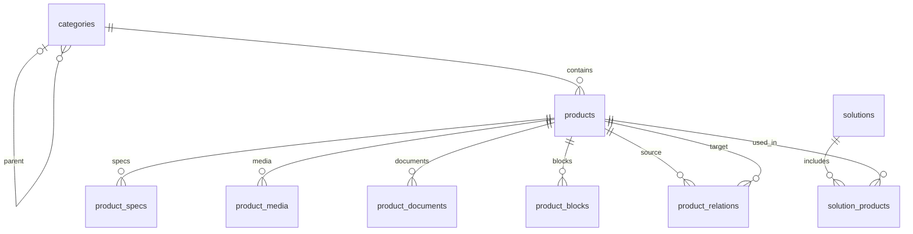

# База данных каталога Q-Trade / MAXHUB Казахстан

## 1. Назначение документа

Это техническое задание для AI-агента, который будет проектировать и реализовывать базу данных, импорт Excel и API каталога. Документ описывает целевую структуру; перечисленные таблицы и API пока не реализованы.

Первый этап — каталог оборудования с карточками товаров и запросом цены. Основа: PostgreSQL, HTTP API и существующий Angular-фронтенд. Добавление опубликованного товара должно менять каталог без изменения исходного кода и повторной сборки сайта.

Не включать в первый этап оплату, заказы, складские резервы, отзывы, отдельную поисковую систему и микросервисы. Не создавать сущности только ради соответствия демонстрационной модели фронтенда.

## 2. Исходные данные и состояние проекта

Исходный файл: `C:\Users\Admin\Downloads\Telegram Desktop\MAXHUB_KZ_База_товаров.xlsx`.

Факты по проверенному файлу:

- 18 категорий: 8 корневых и 10 дочерних; текущая глубина — два уровня категорий.
- 42 товара: 2 со статусом «Опубликован», 40 — «Черновик».
- У всех товаров цена отсутствует, «Показывать цену» = «Нет», наличие = «Под заказ».
- Названия товаров и категорий на KZ не заполнены.
- 24 характеристики, 7 блоков страницы, 5 записей медиа и 2 документа относятся к `xboard-v7-mtr`.
- Есть 4 решения и 1 пример проекта с названием клиента-заглушкой.
- Все 5 записей медиа имеют «Готово» = «Нет»; вложенных изображений в Excel нет.
- Проверенные ID товаров и slug уникальны; ссылки на категории, родительские категории, товары и решения существуют.
- У опубликованных товаров также есть пропуски обязательных по шаблону полей. Статус в Excel не является доказательством готовности карточки.

В проекте уже есть `ProductService`, `ApiService` и Express-сервер Angular SSR в `src/server.ts`. Страницы каталога и меню пока используют статические массивы. HTTP API можно разместить в существующем Express-сервере перед обработчиком Angular SSR.

Текущая модель `Product` требует цену и остаток; она должна быть изменена под реальные данные. Не подставлять нулевую цену, фиктивные остатки, оценки или отзывы ради старого интерфейса.

## 3. Общие правила модели

### Идентификаторы и типы

- ID категорий, товаров, решений и проектов — `text`, сохраняющий исходный ID из Excel. ID не меняется при редактировании названия или slug.
- ID дочерних записей — `bigint GENERATED BY DEFAULT AS IDENTITY`.
- Slug — уникальный внутри своей таблицы `text`, латиница в нижнем регистре, цифры и дефисы. Проверять в API и импорте.
- Деньги — `numeric(14,2)`, не `float`/`double precision`.
- Время — `timestamptz`, даты версий документов — `date`.
- Списки текстовых значений — `text[]`; не хранить разделитель `;` как часть структуры БД.
- Для закрытых наборов значений использовать `text` с `CHECK`; отдельные таблицы справочников и PostgreSQL ENUM на этом этапе не требуются.
- Основные сущности имеют `created_at` и `updated_at` с начальным значением `now()`. При фактическом изменении API/импорт обновляет `updated_at`.
- Если поле явно не помечено `NULL`, оно `NOT NULL`.

### Языки и неполные данные

- Для имеющихся языков использовать отдельные поля `_ru`, `_kz`, а для названий категорий также `_en`.
- KZ/EN-поля допускают `NULL`. Пустой перевод не превращать в выдуманный перевод.
- Публичный API выбирает запрошенный язык; при отсутствии KZ-текста возвращает соответствующий RU-текст. Административный API возвращает исходные поля отдельно.
- Пустые строки необязательных полей нормализовать в `NULL`.
- Основные названия RU обязательны. Дополнительные описания, модель и маркетинговые тексты допускают `NULL`, чтобы текущие черновики можно было импортировать.
- Форматные и ссылочные ошибки блокируют импорт. Отсутствие контента или файла формирует предупреждение, а не уничтожает запись.

## 4. Таблицы первого этапа

### 4.1. `categories` — дерево каталога

| Поле                               | Тип                                | Назначение                              |
| ---------------------------------- | ---------------------------------- | --------------------------------------- |
| `id`                               | `text`, PK                         | ID категории из Excel                   |
| `parent_id`                        | `text`, NULL, FK → `categories.id` | Родитель; NULL у корневой категории     |
| `slug`                             | `text`, UNIQUE                     | Адрес категории                         |
| `name_ru`                          | `text`                             | Название RU                             |
| `name_kz`, `name_en`               | `text`, NULL                       | Переводы названия                       |
| `description_ru`, `description_kz` | `text`, NULL                       | Краткие описания                        |
| `image_key`                        | `text`, NULL                       | Ожидаемый ключ изображения меню         |
| `sort_order`                       | `integer`, DEFAULT 0               | Порядок среди категорий одного родителя |
| `is_visible`                       | `boolean`, DEFAULT true            | Показывать в каталоге                   |
| `created_at`, `updated_at`         | `timestamptz`                      | Время создания и изменения              |

Правила:

- FK родителя: `ON DELETE RESTRICT`. Перед удалением родителя перенести/удалить дочерние категории.
- FK категории из товаров также запрещает удаление используемой категории.
- `CHECK (parent_id IS NULL OR parent_id <> id)` запрещает прямую ссылку на себя.
- Полный цикл, например A → B → C → A, проверять рекурсивно при импорте и перемещении категории. Все изменения родителей через API выполнять в транзакции с блокировкой изменения дерева, чтобы конкурентные перемещения не создали цикл.
- Не ограничивать схему двумя уровнями: `parent_id` поддерживает более глубокое дерево.
- Скрытая категория скрывает всю свою ветку в публичном API, включая товары потомков.
- Порядок детерминирован: `sort_order`, затем `id`. Значения порядка могут повторяться.
- Количество товаров вычислять по опубликованным товарам всей видимой ветки, не хранить отдельным изменяемым счётчиком.

Пример: `collab` → `collab-xboard` → товар `xboard-v7-mtr`.

### 4.2. `products` — основная информация о товаре

| Поле                           | Тип                          | Назначение                                                              |
| ------------------------------ | ---------------------------- | ----------------------------------------------------------------------- |
| `id`                           | `text`, PK                   | Постоянный ID товара из Excel                                           |
| `category_id`                  | `text`, FK → `categories.id` | Одна категория товара                                                   |
| `slug`                         | `text`, UNIQUE               | Адрес карточки                                                          |
| `name_ru`, `name_kz`           | `text`; KZ NULL              | Названия                                                                |
| `brand`                        | `text`, DEFAULT 'MAXHUB'     | Бренд; отдельная таблица пока не нужна                                  |
| `model`                        | `text`, NULL                 | Модель / артикул производителя; не считать автоматически уникальным SKU |
| `tagline_ru`, `tagline_kz`     | `text`, NULL                 | Слоганы                                                                 |
| `summary_ru`, `summary_kz`     | `text`, NULL                 | Краткие описания из Excel                                               |
| `benefits`                     | `text[]`, DEFAULT '{}'       | Преимущества в исходном порядке                                         |
| `variants`                     | `text[]`, DEFAULT '{}'       | Названия вариантов / диагоналей, пока без отдельных SKU                 |
| `status`                       | `text`, DEFAULT 'draft'      | `draft`, `published`, `hidden`                                          |
| `price`                        | `numeric(14,2)`, NULL        | Цена «от» в тенге; NULL = неизвестна                                    |
| `currency`                     | `text`, DEFAULT 'KZT'        | На первом этапе `CHECK (currency = 'KZT')`                              |
| `show_price`                   | `boolean`, DEFAULT false     | Разрешено ли показывать цену публично                                   |
| `availability`                 | `text`                       | `in_stock`, `on_order`, `expected`, `discontinued`                      |
| `stock_quantity`               | `integer`, NULL              | Известный остаток; в текущем Excel отсутствует                          |
| `delivery_time`                | `text`, NULL                 | Человеческий срок поставки                                              |
| `warranty`                     | `text`, NULL                 | Гарантия                                                                |
| `badge`                        | `text`, NULL                 | `new`, `hit`, `discount`                                                |
| `sort_order`                   | `integer`, DEFAULT 0         | Порядок в категории                                                     |
| `seo_title`, `seo_description` | `text`, NULL                 | SEO-поля                                                                |
| `manufacturer_url`             | `text`, NULL                 | Страница производителя                                                  |
| `content_manager_note`         | `text`, NULL                 | Внутренний комментарий; не отдавать публично                            |
| `created_at`, `updated_at`     | `timestamptz`                | Время создания и изменения                                              |

Ограничения и поведение:

- `category_id`: `ON DELETE RESTRICT`.
- `CHECK (price IS NULL OR price >= 0)`.
- `CHECK (NOT show_price OR price IS NOT NULL)`.
- `CHECK (stock_quantity IS NULL OR stock_quantity >= 0)`.
- `price = NULL` не означает бесплатный товар; `stock_quantity = NULL` не означает отсутствие на складе.
- Если `show_price = false`, публичный API возвращает `price: null`, даже если внутренняя цена заполнена. UI показывает «Запросить цену».
- Не включать покупку только на основании известной цены: на первом этапе основной сценарий — запрос цены/предложения.
- `discontinued` может оставаться опубликованным для справки; UI показывает соответствующий статус.
- Импорт сохраняет исходный статус. Недостающие тексты у опубликованной записи отмечаются предупреждениями; не переводить её в черновик молча.
- Для новой публикации через административный API требовать как минимум название, slug, категорию и корректные значения полей. Пустые переводы/медиа допускаются с предупреждением, пока работаем с имеющимся контентом.
- Полного текстового описания отдельным полем в Excel нет: не придумывать его. Длинную страницу строить из `product_blocks`, краткий текст брать из `summary_*`.

### 4.3. `product_specs` — сгруппированные характеристики

| Поле                 | Тип                        | Назначение                              |
| -------------------- | -------------------------- | --------------------------------------- |
| `id`                 | `bigint`, PK               | ID строки                               |
| `product_id`         | `text`, FK → `products.id` | Владелец                                |
| `group_name`         | `text`                     | Дисплей, Камера, Компьютер и т. п.      |
| `name_ru`, `name_kz` | `text`; KZ NULL            | Название параметра                      |
| `value`              | `text`                     | Исходное значение с единицами измерения |
| `sort_order`         | `integer`                  | Порядок строки                          |
| `for_comparison`     | `boolean`, DEFAULT false   | Участие в сравнении                     |

FK: `ON DELETE CASCADE`. Ключ повторного импорта: `UNIQUE (product_id, group_name, name_ru)`.

Сохранять группы и порядок. Не сводить все характеристики к одному плоскому объекту `attributes`, теряющему группы и метаданные. Строки сортировать по `sort_order`, затем `id`; порядок групп определять по первой строке каждой группы.

### 4.4. `product_media` — фотографии, баннеры, видео и иконки

| Поле         | Тип                        | Назначение                                                               |
| ------------ | -------------------------- | ------------------------------------------------------------------------ |
| `id`         | `bigint`, PK               | ID записи                                                                |
| `product_id` | `text`, FK → `products.id` | Владелец                                                                 |
| `type`       | `text`                     | `main_image`, `gallery_image`, `interior_image`, `video`, `icon`, `hero` |
| `file_key`   | `text`                     | Ключ файла / ожидаемое имя из Excel                                      |
| `sort_order` | `integer`, DEFAULT 0       | Порядок внутри типа                                                      |
| `alt_ru`     | `text`, NULL               | Описание изображения                                                     |
| `source`     | `text`, NULL               | Пресс-кит, съёмка и т. п.                                                |
| `is_ready`   | `boolean`, DEFAULT false   | Файл проверен и пригоден к публикации                                    |

FK: `ON DELETE CASCADE`. Ключ импорта: `UNIQUE (product_id, type, file_key)`. Частичный уникальный индекс по `product_id` для `type = 'main_image'`: одно главное фото на товар.

`is_ready` не заменяет проверку существования файла. В публичные готовые медиа включать только записи, для которых подтверждены готовность и доступность файла. Не публиковать URL отсутствующего файла.

`source = 'YouTube MAXHUB'` — описание источника, а не URL ролика. Текущий файл видео импортировать как ожидаемый `file_key`; внешние видео-ссылки добавить отдельным полем при появлении таких данных.

### 4.5. `product_documents` — документы товара

| Поле           | Тип                        | Назначение                                                              |
| -------------- | -------------------------- | ----------------------------------------------------------------------- |
| `id`           | `bigint`, PK               | ID записи                                                               |
| `product_id`   | `text`, FK → `products.id` | Владелец                                                                |
| `type`         | `text`                     | `brochure`, `datasheet`, `manual`, `certificate`, `software`, `drawing` |
| `title`        | `text`                     | Название документа на сайте                                             |
| `file_key`     | `text`, NULL               | Локальный ключ файла                                                    |
| `external_url` | `text`, NULL               | Внешняя HTTP(S)-ссылка                                                  |
| `language`     | `text`                     | `ru`, `kz`, `en`                                                        |
| `version_date` | `date`, NULL               | Дата версии                                                             |

FK: `ON DELETE CASCADE`. `CHECK ((file_key IS NOT NULL) <> (external_url IS NOT NULL))`: заполнен ровно один источник.

Для идемпотентности импорта — два частичных уникальных индекса: `(product_id, language, file_key)` при непустом `file_key` и `(product_id, language, external_url)` при непустом `external_url`.

Имя PDF в Excel не подтверждает наличие файла. Для отсутствующего локального документа скрывать ссылку скачивания; внешние ссылки не считать автоматически проверенными или скачанными.

### 4.6. `product_blocks` — блоки страницы товара

| Поле                   | Тип                        | Назначение                                                                                    |
| ---------------------- | -------------------------- | --------------------------------------------------------------------------------------------- |
| `id`                   | `bigint`, PK               | ID записи                                                                                     |
| `product_id`           | `text`, FK → `products.id` | Владелец                                                                                      |
| `sort_order`           | `integer`                  | Номер блока из Excel                                                                          |
| `type`                 | `text`                     | `hero`, `feature`, `feature_dark`, `gallery`, `video`, `benefits_grid`, `variants`, `metrics` |
| `background`           | `text`                     | `white`, `light_gray`, `black`                                                                |
| `eyebrow`              | `text`, NULL               | Надзаголовок                                                                                  |
| `title_ru`, `title_kz` | `text`; KZ NULL            | Заголовки                                                                                     |
| `body_ru`, `body_kz`   | `text`, NULL               | Тексты                                                                                        |
| `media_key`            | `text`, NULL               | Ожидаемое имя файла блока                                                                     |

FK: `ON DELETE CASCADE`. `UNIQUE (product_id, sort_order)`.

В текущем файле некоторые медиа блоков отсутствуют на листе «Медиа». Поэтому `media_key` — ключ файла, а не обязательный FK на `product_media`. При импорте сообщать о таком расхождении, сохранять исходное имя и показывать блок с предусмотренной заглушкой/без изображения.

Тексты — обычный текст, не произвольный HTML. Не строить универсальный конструктор страниц. Каждый поддерживаемый тип отображается конкретным Angular-компонентом. Упомянутый в комментариях Excel PDF с дизайн-ТЗ не предоставлен; точное оформление блоков не выводить из предположений.

### 4.7. `product_relations` — связанные товары

| Поле                 | Тип                        | Назначение                                     |
| -------------------- | -------------------------- | ---------------------------------------------- |
| `product_id`         | `text`, FK → `products.id` | Товар, на странице которого показывается связь |
| `related_product_id` | `text`, FK → `products.id` | Рекомендованный товар                          |
| `sort_order`         | `integer`, DEFAULT 0       | Порядок в списке                               |

PK: `(product_id, related_product_id)`. Оба FK: `ON DELETE CASCADE`. `CHECK (product_id <> related_product_id)`.

Связь направленная: рекомендация B на странице A не создаёт автоматически рекомендацию A на странице B. Импортировать порядок ID, перечисленных через `;`. Публично показывать только доступные опубликованные связанные товары.

### 4.8. `solutions` — решения

| Поле                       | Тип                     | Назначение                     |
| -------------------------- | ----------------------- | ------------------------------ |
| `id`                       | `text`, PK              | ID решения из Excel            |
| `slug`                     | `text`, UNIQUE          | Адрес страницы решения         |
| `name_ru`, `name_kz`       | `text`; KZ NULL         | Названия                       |
| `audience`                 | `text`, NULL            | Для кого                       |
| `description_ru`           | `text`, NULL            | Описание                       |
| `room_variants`            | `text[]`, DEFAULT '{}'  | Варианты комнат                |
| `cover_key`                | `text`, NULL            | Ключ обложки                   |
| `sort_order`               | `integer`, DEFAULT 0    | Порядок                        |
| `status`                   | `text`, DEFAULT 'draft' | `draft`, `published`, `hidden` |
| `created_at`, `updated_at` | `timestamptz`           | Время создания и изменения     |

Slug и статус отсутствуют на листе решений: при первоначальном импорте slug = исходный ID, статус = `draft`; эти начальные значения не перезаписывают уже отредактированную запись при повторном импорте.

Решение — отдельная сущность. Например Microsoft Teams Rooms не следует автоматически превращать в категорию каталога.

### 4.9. `solution_products` — товары в решениях

| Поле          | Тип                         | Назначение               |
| ------------- | --------------------------- | ------------------------ |
| `solution_id` | `text`, FK → `solutions.id` | Решение                  |
| `product_id`  | `text`, FK → `products.id`  | Товар                    |
| `sort_order`  | `integer`, DEFAULT 0        | Порядок товара в решении |

PK: `(solution_id, product_id)`. Оба FK: `ON DELETE CASCADE`.

Это связь M:N: один товар подходит нескольким решениям, одно решение включает несколько товаров.

Excel задаёт её в двух местах: «Решения» у товара и «Товары в решении» у решения. При первоначальном импорте объединять обе стороны без дубликатов; расхождения выводить в отчёт. Порядок брать из листа решений, недостающие там товары дописывать в конец по ID. После импорта единственный источник связи — эта таблица.

## 5. Проекты: второй этап, данные не потерять

Лист «8. Проекты в КЗ» описывает отдельный раздел сайта. В первом этапе сохранить его в исходном Excel и отметить в отчёте как не импортированный. Не публиковать пример `case-001` как реальный кейс: у клиента стоит заглушка.

Когда раздел будет реализован, добавить:

| Таблица            | Поля и связи                                                                                                                                                              |
| ------------------ | ------------------------------------------------------------------------------------------------------------------------------------------------------------------------- |
| `projects`         | `id text PK`, `slug text UNIQUE`, `client_name`, `city`, `industry`, `description_ru`, `quote NULL`, `year integer`, `status DEFAULT 'draft'`, `created_at`, `updated_at` |
| `project_products` | `project_id FK → projects.id`, `product_id FK → products.id`, `sort_order`; составной PK `(project_id, product_id)`                                                       |
| `project_media`    | `id bigint PK`, `project_id FK → projects.id`, `file_key`, `alt_ru NULL`, `sort_order`, `is_ready DEFAULT false`; UNIQUE `(project_id, file_key)`                         |

Для связующих и дочерних записей использовать `ON DELETE CASCADE`. Остальные проверки аналогичны товарам и медиа.

## 6. Карта отношений

Итого на первом этапе: **9 таблиц**. Проекты потребуют ещё 3 таблицы, когда появится задача реализовать этот раздел.

## 7. Индексы и ограничения

Кроме PK, UNIQUE и CHECK, перечисленных у таблиц:

- `categories (parent_id, sort_order, id)` — дочерние категории.
- `products (category_id, status, sort_order, id)` — каталог категории.
- `product_specs (product_id, sort_order, id)` — характеристики.
- `product_media (product_id, type, sort_order, id)` — медиа.
- `product_documents (product_id)` — документы.
- `product_blocks`: UNIQUE `(product_id, sort_order)` уже покрывает чтение блоков.
- `product_relations (related_product_id)` — обратная сторона FK.
- `solution_products (product_id)` — решения товара.
- `solution_products (solution_id, sort_order, product_id)` — упорядоченный состав решения.

PostgreSQL не создаёт индекс на каждый FK автоматически. Проверить перечисленные индексы с учётом уже созданных PK/UNIQUE и не дублировать одинаковые.

Не добавлять GIN, полнотекстовый поиск, отдельную таблицу брендов или материализованные счётчики заранее. Для текущих 42 товаров достаточно параметризованного поиска по названию/модели и обычных индексов. При сортировке цены использовать `NULLS LAST`.

Обычная операция удаления товара — изменение статуса на `hidden`. Физическое удаление через административный API должно быть явно выбранной операцией; CASCADE удаляет только записи и связи в БД, но не файлы из хранилища.

## 8. Импорт Excel

### Соответствие листов

| Лист                           | Таблицы                                              |
| ------------------------------ | ---------------------------------------------------- |
| `1. Категории`                 | `categories`                                         |
| `2. Товары`                    | `products`, `product_relations`, `solution_products` |
| `3. Блоки страницы`            | `product_blocks`                                     |
| `4. Медиа`                     | `product_media`                                      |
| `5. Документы`                 | `product_documents`                                  |
| `6. Решения`                   | `solutions`, `solution_products`                     |
| `7. Характеристики`            | `product_specs`                                      |
| `8. Проекты в КЗ`              | Второй этап                                          |
| `0. Инструкция`, `Справочники` | Правила и допустимые значения; не таблицы каталога   |

Строка 1 — инструкция, строка 2 — заголовки, данные начинаются со строки 3. Читать столбцы по заголовкам, а не только по позиции. Пустые оформленные строки пропускать; непустая строка без обязательного ID — ошибка с номером строки.

### Преобразования

| Excel                                                           | БД                                                                          |
| --------------------------------------------------------------- | --------------------------------------------------------------------------- |
| `Опубликован` / `Черновик` / `Скрыт`                            | `published` / `draft` / `hidden`                                            |
| `В наличии` / `Под заказ` / `Ожидается` / `Снят с производства` | `in_stock` / `on_order` / `expected` / `discontinued`                       |
| `Да` / `Нет`                                                    | `true` / `false`                                                            |
| `NEW` / `Хит` / `Скидка` / `—`                                  | `new` / `hit` / `discount` / NULL                                           |
| Пустая цена                                                     | NULL                                                                        |
| Список через `;`                                                | Упорядоченный массив или связующие строки; убрать пробелы и пустые элементы |
| HTTP(S)-ссылка документа                                        | `external_url`                                                              |
| Имя файла документа                                             | `file_key`                                                                  |
| Пустое «Для сравнения»                                          | `false`                                                                     |

Типы медиа, документов, блоков, фон и язык переводить по явной карте из листа «Справочники». Неизвестное значение — ошибка, не молчаливый выбор значения по умолчанию.

### Порядок и атомарность

1. Прочитать и нормализовать все нужные листы.
2. До записи проверить типы, дубликаты, slug, обязательные ID, FK, циклы категорий, конфликты естественных ключей и ограничения цены.
3. Выдать отчёт проверки: лист, строка/ячейка, ID сущности, причина ошибки или предупреждения.
4. В одной транзакции создать/обновить категории сначала без родителей, затем установить связи родителей.
5. Создать/обновить решения и товары.
6. Создать/обновить характеристики, медиа, документы, блоки и связующие таблицы.
7. При ошибке откатить всю транзакцию. Не скачивать файлы и не вызывать внешние сервисы внутри неё.

### Повторный импорт и защита ручных изменений

- Предусмотреть режим проверки без записи (`dry-run`).
- Первый импорт в пустую БД загружает все данные первого этапа, включая черновики.
- Повторный импорт обновляет основные сущности по исходным ID, дочерние — по описанным естественным ключам. Не создавать новые дубликаты при неизменном файле.
- Повторный импорт в непустую БД должен требовать явного выбора, разрешено ли перезаписывать поля, которыми управляет Excel. Без этого разрешения только проверка и отчёт конфликтов.
- Excel управляет только представленными в нём полями. Например `stock_quantity`, бренд, slug/статус решения и фактическая готовность загруженных файлов не должны сбрасываться отсутствующим столбцом или исходным «Не готово».
- По умолчанию отсутствующая строка не удаляет основную сущность, характеристику, документ или связь.
- Для удаления устаревших дочерних записей нужен отдельный явно выбранный режим замены содержимого. Он применяется только к указанным товарам/решениям и выбранным разделам; предварительный отчёт обязан перечислить удаляемые строки. Не выполнять автоматическую очистку всего каталога.
- Изменение естественного ключа дочерней записи выглядит как добавление новой строки. Старую строку удалять через административный API или режим замены, а не угадывать переименование.
- Формировать итоговые количества добавленных/обновлённых/пропущенных записей и предупреждения. Не писать пользовательские заметки и внутренние цены в публичные логи.

## 9. Файлы и изображения

- Сам файл не хранить в PostgreSQL; хранить ключ, тип, alt-текст, порядок и метаданные.
- Для одного VPS достаточно постоянного каталога загрузок вне исходников и папки сборки. Для нескольких серверов — отдельное объектное хранилище.
- Выбор провайдера хранения не должен менять таблицы: API преобразует `file_key` в URL, используя настройки хранилища.
- Отдельный MinIO не является обязательной частью архитектуры. Конкретное хранилище выбирается при настройке развёртывания.
- Ключи файлов должны быть относительными: запрещены абсолютные пути, `..` и выход за разрешённый каталог. Внешние URL проверять отдельно; не загружать их автоматически по произвольному адресу.
- Загрузка доступна только авторизованному управляющему пользователю; проверять размер, расширение и фактический формат файла.
- Для изображений хранить доступные web-версии, сохраняя исходник при необходимости; генерация размеров не требует отдельных бизнес-таблиц.
- Делать резервные копии и БД, и файлов. Восстановление только БД не восстанавливает изображения.
- Для замены изображения использовать новый ключ/версию URL, чтобы браузерный кеш не продолжал показывать старое изображение.

## 10. API и подключение фронтенда

### Публичные запросы первого этапа

| Запрос                                             | Ответ                                                                      |
| -------------------------------------------------- | -------------------------------------------------------------------------- |
| `GET /api/categories`                              | Видимые категории с `parentId`, порядком и вычисленным `productCount`      |
| `GET /api/products?category=xboard&page=1&size=12` | `{ items, total, page, size }`; фильтр по slug категории включает потомков |
| `GET /api/products/:slug`                          | Опубликованный товар, характеристики, готовые медиа, документы и блоки     |
| `GET /api/products/:slug/related`                  | Опубликованные связанные товары в заданном порядке                         |
| `GET /api/brands`                                  | Бренды опубликованных доступных товаров, если этот запрос нужен интерфейсу |

Поддержать поиск по названию/модели, сортировку, ограниченную пагинацию и язык RU/KZ. Валидировать параметры и использовать параметризованные SQL-запросы. Для отсутствующей, скрытой или черновой карточки возвращать 404. Не отдавать внутренние заметки и скрытые цены.

Публичный список товаров и `total` должны использовать одинаковые фильтры статуса/видимости. Фильтры по цене применяются только к публично показываемым ценам, чтобы скрытую цену нельзя было узнать через подбор фильтра. `inStockOnly` означает `availability = 'in_stock'`, а не проверку неизвестного остатка.

Доступ к PostgreSQL есть только у сервера. Не помещать строку подключения, административные ключи или права записи в Angular. Все административные операции проверяют аутентификацию и права на сервере; frontend guard не является защитой API.

### Изменения существующего интерфейса

- Убрать статические категории/товары из `header.ts` и `product-category.ts`, получать их через сервисы.
- Согласовать маршруты: `/catalog/:slug` для категории, `/products/:slug` для товара.
- Изменить DTO: nullable цена/остаток, статус наличия, `showPrice`, сгруппированные характеристики, документы и блоки. Административный DTO отличается от публичного.
- Данные БД не обязаны повторять названия полей Angular: например `name_ru` преобразуется в локализованный `title` на границе API.
- Убрать зависимости интерфейса от фиктивных рейтингов, отзывов и скидочной цены. Метка «Скидка» сама по себе не задаёт размер скидки.
- Отключить mock API при подключении настоящего бэкенда.
- Страницы с динамическим каталогом и меню не должны оставаться статическим снимком сборки. Для таких страниц настроить SSR на запрос либо загрузку актуальных данных в браузере.
- Изменения видны при следующем запросе. WebSocket и мгновенное обновление уже открытой вкладки на первом этапе не нужны.

Эндпоинты featured/reviews из старого `ProductService` не создают обязательства придумывать данные. Реализовать их только при появлении соответствующего сценария и источника данных.

## 11. Порядок реализации для AI-агента

1. Подготовить миграции PostgreSQL для 9 таблиц первого этапа, ограничений и индексов.
2. Добавить конфигурацию подключения через переменные окружения и пример конфигурации без секретов.
3. Реализовать импорт исходного Excel с проверкой, транзакцией и отчётом.
4. Проверить загруженные сущности, иерархию и идемпотентность повторного импорта.
5. Реализовать публичный API каталога и преобразование в DTO.
6. Подключить категории/товары к Angular, затем карточку товара и файлы.
7. Административный API и интерфейс управления реализовать отдельным этапом с серверной проверкой прав.

Если агенту поручена только БД, остановиться после миграций, импорта, проверок и инструкции запуска. Этот документ не является разрешением самостоятельно разворачивать production, публиковать сайт или подключать платные сервисы.

## 12. Критерии приёмки

- Первый импорт создаёт 18 категорий и 42 товара, сохраняя исходные ID, 2 опубликованных товара и 40 черновиков.
- Все цены остаются NULL, валюта KZT, `show_price = false`, наличие `on_order`, остатки NULL.
- Загружаются 24 характеристики, 7 блоков, 5 неготовых медиа, 2 документа и 4 решения со связями.
- Недостающие KZ-переводы, тексты и файлы отражены в отчёте; импорт не придумывает данные.
- Повторный явно разрешённый импорт того же файла не увеличивает число сущностей и связей.
- Неизвестная категория/товар/решение, повторяющийся ID или цикл категорий не оставляют частично обновлённую БД.
- Родительская категория показывает опубликованные товары потомков; скрытая ветка исключается из публичного каталога.
- API не раскрывает скрытые цены и внутренние комментарии.
- Новая опубликованная запись становится доступной через API при следующем запросе без сборки Angular; черновик публично недоступен.
- Отсутствующий файл не превращается в рабочую ссылку; восстановление БД и загрузок описано в инструкции.
- Оставить одну небольшую runnable-проверку импорта и ключевых запросов: количества, повторный импорт, откат при ошибке и чтение ветки категорий. Не создавать отдельный тестовый фреймворк ради этой проверки, если существующих средств достаточно.

## 13. Отложенные расширения

- `product_variants` — когда диагонали имеют отдельные SKU, цены и остатки.
- Заказы/оплата/резервы — когда появятся правила онлайн-продажи и источник цен/остатков. При реализации заказа фиксировать цену и название в позиции заказа на момент оформления.
- Полноценные пользователи/роли — при реализации управления и личного кабинета; способ административной аутентификации выбрать тогда.
- Отзывы/рейтинги — при появлении реальных пользовательских отзывов.
- Проекты — по структуре раздела 5.
- Отдельная система поиска, кеш и очередь задач — при измеримой необходимости.

Каждое расширение добавлять миграцией. Текущая база должна решать каталог из предоставленного Excel, без инфраструктуры для предполагаемых будущих нагрузок.
