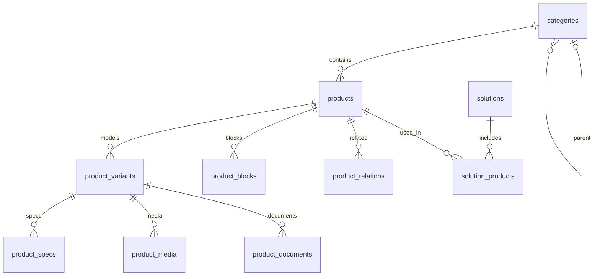

# Бэкенд, API и база данных

Весь контент каталога приходит из соседнего проекта **`../Q-trade-business`**. Во фронтенде
нет ни моков, ни демо-товаров: пустой экран означает, что API недоступен или данных нет.
Данные заказчика (папка «Каталог»: книги Excel, архивы фото, PDF) загружает импортёр бэкенда:
`npm run dry-run` проверяет, `npm run import` заменяет каталог в БД и раскладывает файлы в `storage/`.

## Цепочка

```
PostgreSQL 18 (docker compose, порт 127.0.0.1:55432)
      ▲
      │ pg
Express API  ../Q-trade-business/src/api  →  http://localhost:3000/api
      ▲
      │ dev: прямой запрос с :4200   prod: /api через Express фронтенда (API_ORIGIN)
Angular (этот проект)
```

Бэкенд: Node + Express + `pg`, миграции `node-pg-migrate`, импорт каталога из папки заказчика
(Excel читается собственным парсером `import/xlsx.ts`, архивы — `fflate`).
Команды в его `package.json`: `db:up`, `migrate`, `dry-run`, `import`, `verify`, `dev`, `test`.

Перед запуском фронтенда должен отвечать `http://localhost:3000/api/health` → `{"status":"ok"}`,
а в настройках бэкенда разрешён origin: `FRONTEND_ORIGINS=http://localhost:4200,http://127.0.0.1:4200`.

## Endpoints

Полный контракт: `../Q-trade-business/API_CONTRACT.md`. Коротко:

| Метод и путь                      | Параметры                                                              | Ответ                                                                                     |
| --------------------------------- | ---------------------------------------------------------------------- | ----------------------------------------------------------------------------------------- |
| `GET /api/health`                 | —                                                                      | `{ status: 'ok' }`                                                                        |
| `GET /api/categories`             | `lang`                                                                 | `CategoryDto[]` — плоский список, дерево строится по `parentId`; `imageUrl` — фото товара |
| `GET /api/products`               | `category, q, page, size, sort, inStockOnly, minPrice, maxPrice, lang` | `{ items, total, page, size }`                                                            |
| `GET /api/products/:slug`         | `lang`                                                                 | `ProductDetailDto`: модели с характеристиками, фото, документами                          |
| `GET /api/products/:slug/related` | `lang, limit`                                                          | `ProductCardDto[]`                                                                        |
| `GET /api/brands`                 | —                                                                      | `string[]`                                                                                |
| `GET /api/files/:name`            | —                                                                      | Фото или PDF из `storage/`, кэш на год (имя = хэш содержимого)                            |

Границы: `page` 1–1 000 000, `size` 1–60 (по умолчанию 12), `limit` 1–20 (по умолчанию 4),
`q` до 200 символов, `lang` = `ru` \| `kz`. Нарушение формата, повтор параметра или неизвестное
имя дают **400**; неизвестная категория или непубличный товар — **404** с телом
`{ error: { code, message } }`. Это тело показывает `errorInterceptor` в тосте.

DTO контракта совпадают с типами в [`core/models/product.ts`](../src/app/core/models/product.ts)
(`Category`, `Product`, `ProductDetail`, `ProductModel`, `ProductImage`). Менять их нужно синхронно с контрактом.

## Товар, серия и модель

**Товар = серия** (`XBoard V7 Series`) или одиночное устройство (`UC P30`). Его **модели**
(`V5550`, `V6550` и т. д. — диагональ или шаг пикселя) лежат в `product_variants`, а характеристики,
фото и документы принадлежат **модели**, а не товару. В карточке `variants` — подписи моделей
(например `55"`, `65"`), пусто, если модель одна. В детальном ответе `models[]` содержит всё
для каждой модели; страница товара выбирает модель по `?model=<артикул>` (первая — по умолчанию).

## Правила данных, которые нельзя нарушать в UI

- **Публичность**: товар виден только при `status=published` и видимых предках категории.
  Скрытая ветка исключает потомков из `/categories`.
- **Цена**: `price: null` означает неизвестную или скрытую цену, а не ноль и не «бесплатно».
  При `showPrice=false` сервер всегда отдаёт `null`. UI показывает «Цена по запросу».
- **Остаток**: `stockQuantity: null` — неизвестно, а не «нет в наличии». Наличие определяет `availability`
  (`in_stock`, `on_order`, `expected`, `discontinued`).
- **Язык**: `lang=kz` подставляет RU-текст там, где KZ пуст. Выдуманных переводов быть не должно.
- **Медиа**: API отдаёт пути вида `/api/files/<хэш>.png`; `ProductService` превращает их в адрес
  API-сервера (в dev это другой origin, в проде — тот же через прокси `/api`). У карточки в `images`
  одно главное фото (или иконка у ПО), полная галерея — в `models[].media`. `imageUrl` категории — главное
  фото первого опубликованного товара ветки (своих картинок у категорий нет; `null`, если в ветке нет
  готовых фото, например у ПО); `block.media` пока `null`. Фронтенд обязан переживать пустые
  изображения: тогда рисуется CSS-фигура (`features/products/device-shape.ts`).
- **Обрезка главных фото**: у 30 из 40 файлов `main_image` в `../Q-trade-business/storage` обрезаны пустые
  поля (устройство занимает почти весь кадр, отступ ~3%); иначе фото в карточке выглядят мелкими.
  Оригиналы этих 30 файлов — в `../Q-trade-business/backups/storage-pre-trim-20261003`. **`npm run import`
  кладёт в `storage/` необрезанные оригиналы заново** — после импорта обрезку надо повторить (скрипт
  не хранится в репозитории: Pillow, фон по углам или альфа-канал, порог ~14 из 255). Галерейные
  фото и иконки не обрезались.
- **Кэш файлов**: `Cache-Control: immutable` на год. Подмена файла под тем же именем не видна уже
  открывавшему страницу браузеру — нужен жёсткий reload (Ctrl+Shift+R).
- **Документы**: свой PDF — `downloadUrl` (`/api/files/…`), иначе `externalUrl` — прямая ссылка
  производителя на PDF. Все документы английские (`language: 'en'`).
- Рейтинги, отзывы, скидки и фиктивные остатки не придумываются ни на бэкенде, ни в UI.

## Схема БД (9 таблиц первого этапа + `product_variants`)

Подробности и ограничения — в `DATABASE_ARCHITECTURE.md` в корне проекта.



- `categories` — дерево любой глубины через `parent_id`, порядок по `sort_order`, затем `id`.
  Счётчик товаров не хранится, а считается по опубликованным товарам видимой ветки.
- `products` — `id` и `slug` текстовые и стабильные (ID переносится из Excel). Деньги —
  `numeric(14,2)`, статус `draft|published|hidden`.
- `product_variants` — модель товара: артикул `model` (уникален), подпись `label`, порядок.
- `product_specs` — характеристики модели с группами (`group_name`) и порядком; плоского `attributes` нет.
- `product_media` — файлы модели; `file_key` — хэш содержимого в `storage/`, `is_ready` ставит импорт
  после записи файла. Главное фото одно на модель (`main_image`; у ПО — `icon`).
- `product_documents` — ровно один источник: либо `file_key`, либо `external_url`.
- `product_blocks` — блоки страницы товара (`hero`, `feature`, `gallery`, `metrics`, …),
  обычный текст без HTML; каждый тип рисует конкретный компонент.
- `product_relations` — направленные рекомендации; `solutions` + `solution_products` — M:N решения.
- Проекты (`projects`, `project_products`, `project_media`) — второй этап, в БД их ещё нет.

## Текущее состояние данных

18 категорий (8 корневых, 10 дочерних), 44 опубликованных товара, 88 моделей. Источник — файлы
заказчика (папка «Каталог»); импорт заменяет каталог целиком (`DELETE FROM products` и вставка).
Цена пустая, `showPrice=false` (цены видят только вошедшие B2B-партнёры; локально стоят демо-цены). Наличие у всех «под заказ»
по умолчанию — это не данные, поэтому UI не показывает «Под заказ» без срока поставки, а фильтры
«Цена» и «В наличии» на странице категории появляются, только когда в выдаче есть такие товары.
Блоков страницы, связей «С этим покупают» и KZ-текстов в данных нет — эти блоки не показываются.
Характеристики со значением «уточнить…» (пометки менеджера) не импортируются.

## Чего на бэкенде нет

Админского API (статусы заказов, пользователи — только командами и SQL), загрузки файлов через API
(файлы кладёт импорт), оплаты, приёма заявок и запросов на регистрацию, уведомлений менеджеру о заказе,
отзывов и поиска сверх подстроки по названию, модели и артикулу моделей.

## B2B (миграция `1780000000002_b2b`)

Таблицы `users` (роль `b2b|admin`, пароль scrypt), `sessions` (SHA-256 токена, 30 дней), `orders`,
`order_items` (артикул модели, название и цена копируются в момент заказа). Эндпоинты `/api/auth/*`,
`/api/orders` — в `API_CONTRACT.md`. С Bearer-токеном каталог отдаёт цены при `show_price=false`.
Аккаунт: `npm run b2b:user -- --email … --password … --name … --company …`; демо-цены: `npm run demo-prices`
(выдуманные, только локально, `npm run import` их стирает).
